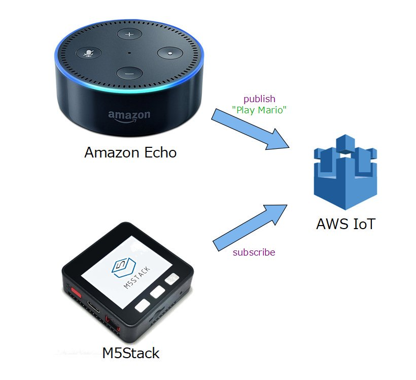

# M5Stack_IoT

## Prepare
- [M5Stack](https://www.switch-science.com/catalog/3647/)  : Switch Science

## Development Environment
- [Arduino IDE](https://www.arduino.cc/en/main/software)
- [arduino-esp32](https://github.com/espressif/arduino-esp32)

## Library
- [PubSubClient](https://github.com/knolleary/pubsubclient)

## Reference
- [AWS IoT Core](https://aws.amazon.com/jp/iot-core/?hp=tile&so-exp=below)

## Usage
- M5Stack can publish and subscribe IoT broker as AWS IoT.
- When other services (devices) publish message and M5Stack subscribes it, you can control M5Stack by the services.
 For example, other services (devices) are web browser, sensor connected internet, Smart Speaker as Amazon Echo, other M5Stacks, or other any IoT services.

 - When M5Stack publishes message and other services (devices), you can control the services by M5Stack.
